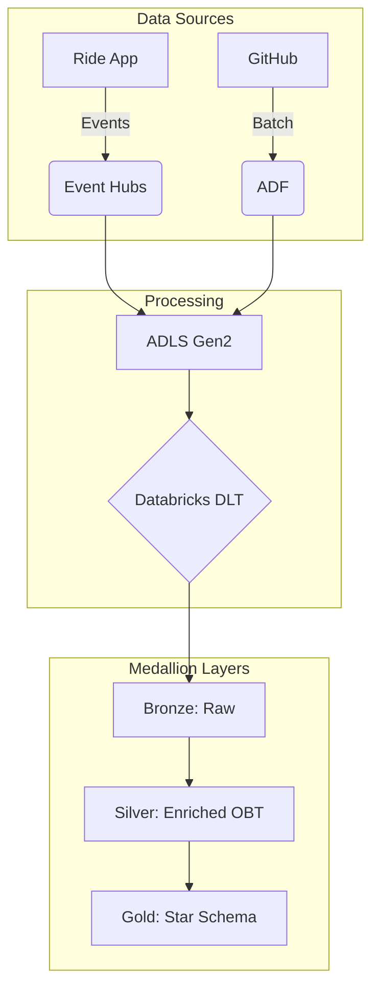

# Uber Data Engineering: Real-Time Ride Analytics 🚖

A complete end-to-end data pipeline implementing the **Medallion Architecture** (Bronze, Silver, Gold) using **Azure Event Hubs**, **ADLS Gen2**, and **Azure Databricks (DLT)**.

---

## 🏗️ Architecture



---

## 🚀 Key Technical Features

*   **Real-time Ingestion**: Spark Structured Streaming from Azure Event Hubs.
*   **Metadata-Driven**: **Jinja2** templating for dynamic SQL and "One Big Table" (OBT) generation.
*   **Reliability**: **Watermarking** for late data and **DLT Expectations** for quality.
*   **CDC/SCD**: Automated historical tracking via **SCD Type 1 & Type 2**.

---

## 🛠️ Tech Stack

*   **Ingestion**: Event Hubs, Azure Data Factory (ADF)
*   **Storage**: ADLS Gen2, Delta Lake
*   **Processing**: Azure Databricks, PySpark, DLT
*   **Tools**: Jinja2, Python

---

## 📂 Project Layers

1.  **Bronze**: Raw ingestion of streaming events and static mapping files (via SAS tokens).
2.  **Silver**: JSON parsing, historical + incremental union, and OBT creation with streaming joins.
3.  **Gold**: Dimensional model (Star Schema) with Fact and Dimension tables (`dim_passenger`, `dim_driver`, `dim_location` - SCD2, etc.).

---

## ⚙️ Quick Start

```bash
# Clone & Setup
git clone https://github.com/anshlambagit/Uber_Data_Engineer_Project.git
brew install uv && uv venv && source .venv/bin/activate
pip install -r requirements.txt

# Run Producer
python api.py
```

---

## 📊 Final Model
*   **Fact**: `fact` (Numerical metrics & FKs)
*   **Dimensions**: `dim_passenger`, `dim_driver`, `dim_vehicle`, `dim_payment`, `dim_location` (SCD2).
